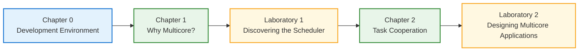

# RP2040 FreeRTOS SMP Course Manual

> Learning Multicore Embedded Systems Through Guided Experiments

---

**Author:** Raúl Peña Ortega

**Institution:** Tecnológico de Monterrey

---

<p align="center">

</p>

---

# Overview

This repository contains a complete course manual designed for undergraduate Embedded Systems courses.

The material introduces multicore embedded programming using the **Raspberry Pi RP2040** microcontroller and the **FreeRTOS SMP** kernel through concise theoretical chapters and hands-on laboratory activities.

Rather than focusing on individual FreeRTOS APIs, the course emphasizes experimentation, allowing students to observe, analyze, and understand the behavior of multicore embedded systems before developing their own concurrent applications.

---

# Course Structure

The course is organized into four complementary components.

| Component | Purpose |
|-----------|---------|
| **Chapters** | Introduce the theoretical concepts required for each laboratory. |
| **Laboratories** | Reinforce the concepts through guided experiments. |
| **Template Project** | Provides a fully configured FreeRTOS SMP project used throughout the course. |
| **Additional Resources** | Troubleshooting guides and reference material. |

---

# Features

- RP2040 dual-core architecture
- FreeRTOS SMP
- Fully self-contained Template Project
- Step-by-step development environment setup
- Hands-on multicore scheduling experiments
- Task communication and synchronization
- Cross-platform development (Windows, Linux, and macOS)

---

# Documentation

| Section | Description | Status |
|----------|-------------|:------:|
| Getting Started | Repository overview | ✅ |
| Chapter 0 | Development Environment | ✅ |
| Chapter 1 | Why do Embedded Systems Need More Than One Processor Core? | ✅ |
| Chapter 2 | Task Communication and Synchronization | 🚧 |
| Laboratory 1 | Discovering the FreeRTOS SMP Scheduler | ✅ |
| Laboratory 2 | Designing Multicore Applications | 🚧 |
| Troubleshooting | Common problems and solutions | 🚧 |
| References | Books and official documentation | 🚧 |

---

# Course Roadmap

The course follows a progressive learning path where each chapter prepares the concepts required for the following laboratory.



Each stage prepares the knowledge required for the next one.

---

# Hardware

The laboratories were designed using the following hardware.

- Pololu Zumo RP2040 Robot
- Raspberry Pi Pico (compatible)

---

# Software

The following software is required.

| Tool | Version |
|------|---------|
| Visual Studio Code | Latest |
| Git | Latest |
| Raspberry Pi Pico Extension | Latest |
| Pico SDK | 2.3.0 |
| FreeRTOS Kernel | V11.x |

> [!NOTE]
>
> The Raspberry Pi Pico Extension automatically downloads and configures the required development tools, including:
>
> - ARM GNU Toolchain
> - CMake
> - Ninja
> - Pico SDK
> - OpenOCD
> - picotool

---

# Repository Structure

```text
rp2040-freertos-smp-labs/
│
├── assets/
│
├── docs/
│   ├── chapter00/
│   ├── chapter01/
│   ├── chapter02/
│   │
│   ├── labs/
│   │   ├── lab01/
│   │   └── lab02/
│   │
│   ├── troubleshooting/
│   └── references/
│
├── template_project/
│
├── README.md
└── LICENSE
```

---

# Template Project

The repository includes a fully configured **FreeRTOS SMP Template Project**.

The project already includes:

- FreeRTOS Kernel
- RP2040 FreeRTOS SMP Port
- FreeRTOS Configuration
- Build System
- Project Structure

No additional FreeRTOS installation or project configuration is required.

---

# Educational Approach

This course is organized as a sequence of chapters and laboratory sessions.

Each chapter introduces the theoretical concepts required to understand a fundamental aspect of multicore embedded systems.

Each laboratory is designed as a guided engineering investigation. Rather than following predefined procedures, students observe system behavior, modify the application, analyze the results, and progressively develop an understanding of how FreeRTOS SMP executes and coordinates tasks across multiple processor cores.

This methodology encourages students to build engineering intuition through experimentation instead of memorizing APIs or implementation details.

---

# License

This repository is distributed for educational purposes.

See the **LICENSE** file for additional information.

---

# Citation

If you use this material in an academic course or research project, please cite this repository.
