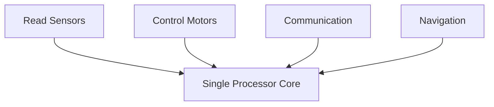
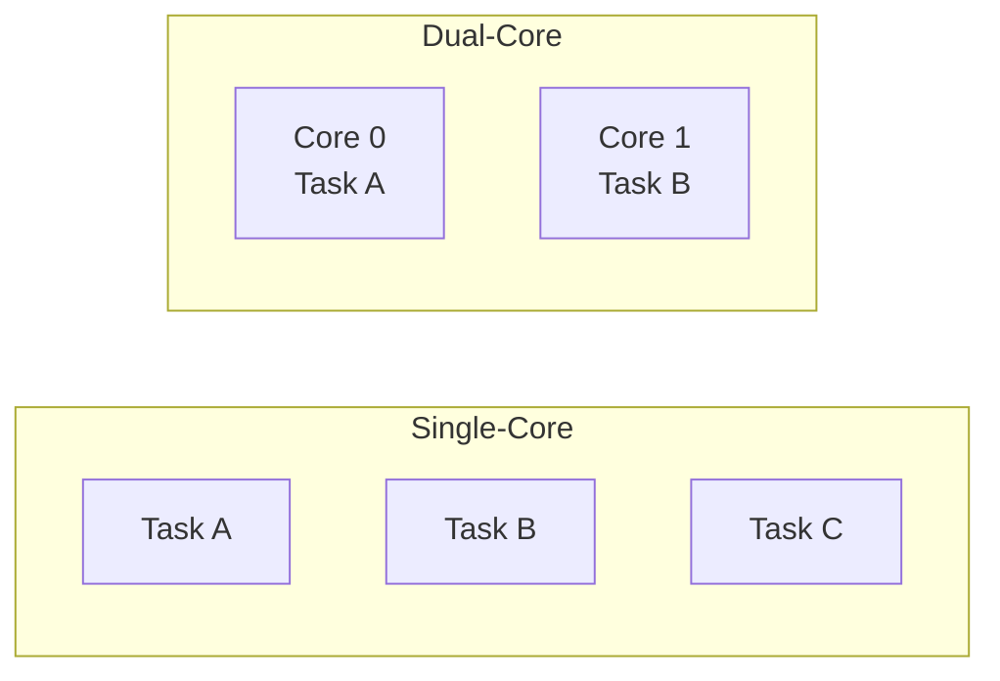
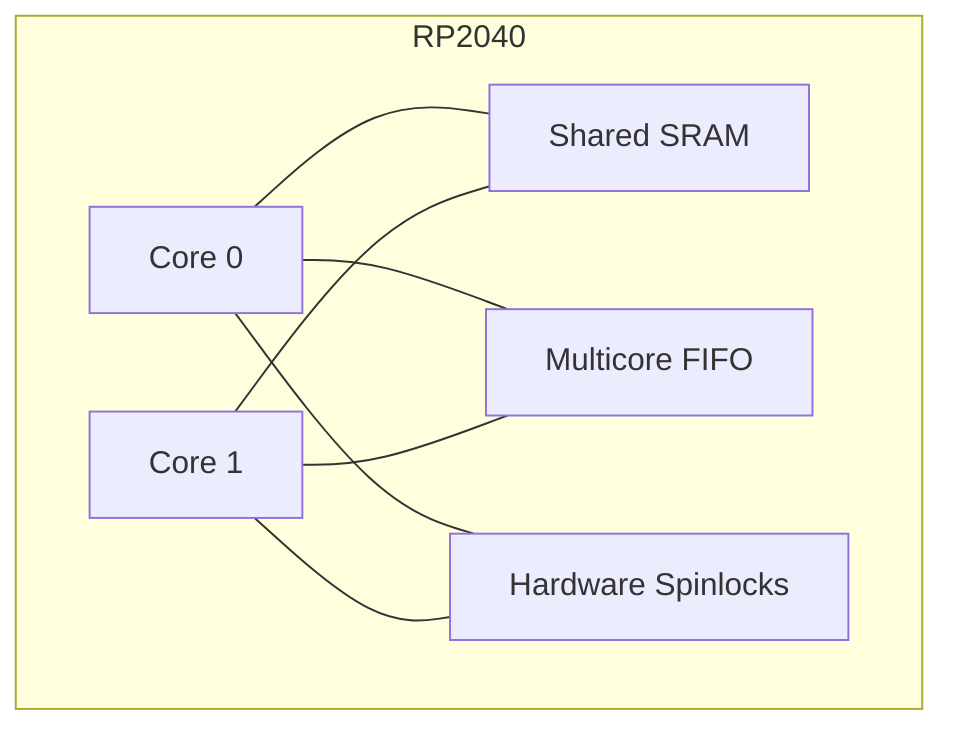

# Chapter 1
# Why do embedded systems need more than one processor core?

---

## Learning Objectives

After completing this chapter, you should be able to:

- Explain why modern embedded systems benefit from multicore processors.
- Differentiate between concurrency and parallelism.
- Describe the main architectural features of the RP2040 multicore processor.
- Explain how FreeRTOS SMP executes tasks on multiple processor cores.
- Apply these concepts during Laboratory 1.

---

# 1. Why Multicore?

Modern embedded systems are expected to execute multiple activities simultaneously. A mobile robot, for example, may need to:

- Read sensors
- Control motors
- Communicate with external devices
- Update a display
- Execute navigation algorithms

Although a Real-Time Operating System (RTOS) allows multiple tasks to share a single processor, only one task can execute at any given instant on a single-core processor.

A multicore processor increases the available processing capability by allowing independent tasks to execute simultaneously.

**Figure 1.1.** Multiple tasks competing for a single processor core.

---

# 2. Concurrency vs. Parallelism

Although these terms are often used interchangeably, they describe different concepts.

**Concurrency** is the ability of multiple tasks to make progress during the same period of time. On a single-core processor, the scheduler rapidly switches between tasks, creating the illusion that they execute simultaneously.

**Parallelism** is the simultaneous execution of multiple tasks using multiple processor cores.

> [!NOTE]
> Every parallel system is concurrent, but not every concurrent system is parallel.

**Figure 1.2.** Concurrency (left) versus parallelism (right).

---

# 3. The RP2040 Architecture

The RP2040 is a dual-core microcontroller developed by Raspberry Pi.

Its main multicore features include:

- Two ARM Cortex-M0+ processor cores
- Shared SRAM memory
- Hardware FIFO for inter-core communication
- Hardware spinlocks
- Shared peripheral bus

Both processor cores execute the same instruction set and have access to the same memory space, allowing them to cooperate efficiently while sharing system resources.

**Figure 1.3.** Simplified RP2040 multicore architecture.

---

# 4. FreeRTOS SMP Overview

Traditional FreeRTOS schedules tasks on a single processor core.

FreeRTOS SMP extends the scheduler so that multiple ready tasks can execute simultaneously on different processor cores.

The scheduler automatically assigns tasks to the available cores. Optionally, task affinity can be used to restrict a task to a specific processor.

During the next laboratory, you will observe how FreeRTOS SMP distributes tasks between both RP2040 cores and how task affinity influences scheduler behavior.

---

# Key Takeaways

After completing this chapter, you should remember the following ideas:

- A single-core processor executes only one task at a time.
- Concurrency and parallelism are different concepts.
- The RP2040 integrates two ARM Cortex-M0+ processor cores.
- Both cores share the same memory system.
- FreeRTOS SMP allows multiple tasks to execute simultaneously on both cores.
- Task affinity can be used to control where a task executes.

---

# Preparing for Laboratory 1

In **Laboratory 1** you will observe the behavior of the FreeRTOS SMP scheduler running on the RP2040.

Before executing the provided application, you will predict how tasks are assigned to each processor core and compare your predictions with the actual execution.

The objective is to understand how a multicore scheduler behaves before learning how to configure and optimize it.
