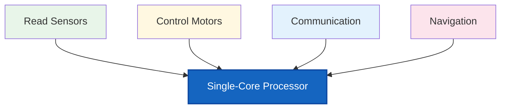
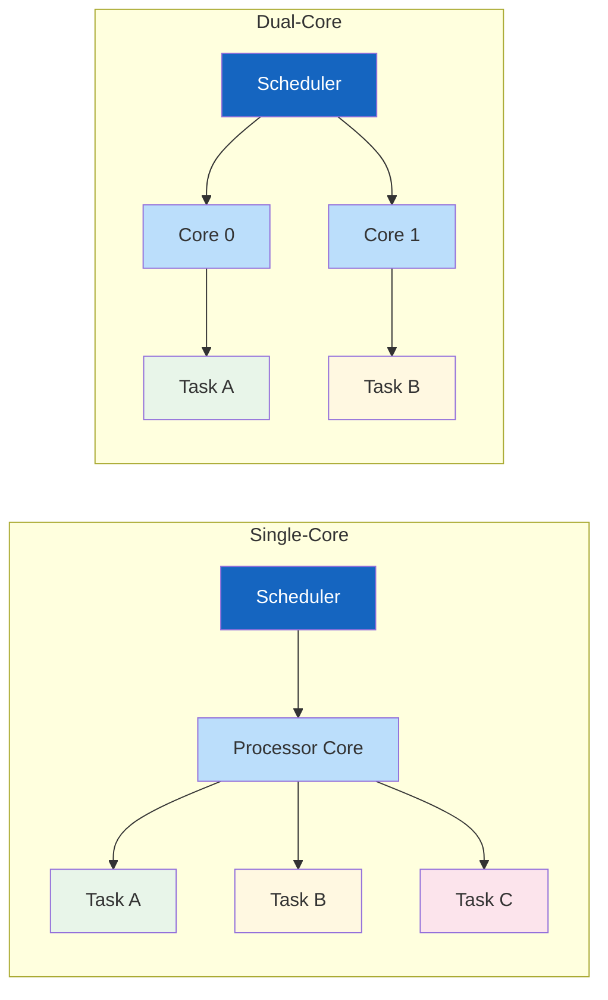
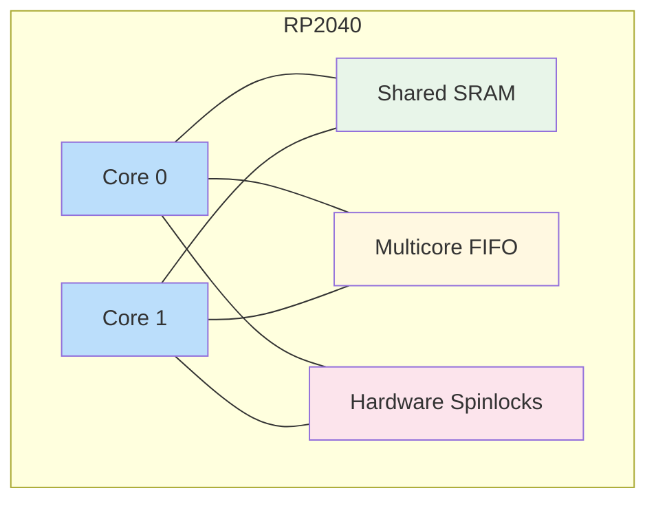

# Chapter 1
# Why Do Embedded Systems Need More Than One Processor Core?

---

---

## Learning Objectives

After completing this chapter, you should be able to:

- Explain why modern embedded systems benefit from multicore processors.
- Differentiate between concurrency and parallelism.
- Describe the main architectural features of the RP2040 multicore processor.
- Explain how FreeRTOS SMP executes tasks on multiple processor cores.
- Predict how the FreeRTOS SMP scheduler distributes tasks across both processor cores.

---

# 1. Why Multicore?

Modern embedded systems are expected to execute multiple activities simultaneously. A mobile robot, for example, may need to:

- Read sensors
- Control motors
- Communicate with external devices
- Update a display
- Execute navigation algorithms

Although a Real-Time Operating System (RTOS) allows multiple tasks to share a single processor, only one task can execute at any given instant on a single-core processor.

A multicore processor increases the available processing capability by allowing independent tasks to execute simultaneously.

**Figure 1.1.** Multiple tasks competing for a single processor core.

---

# 2. Concurrency vs. Parallelism

Although these terms are often used interchangeably, they describe different concepts.

**Concurrency** is the ability of multiple tasks to make progress during the same period of time. On a single-core processor, the scheduler rapidly switches between tasks, creating the illusion that they execute simultaneously.

**Parallelism** is the simultaneous execution of multiple tasks using multiple processor cores.

In practice, modern embedded systems often combine both techniques. Multiple tasks execute concurrently, while multiple processor cores allow some of those tasks to execute in parallel.

> [!NOTE]
>
> Every parallel system is concurrent, but not every concurrent system is parallel.

**Figure 1.2.** Concurrency (left) versus parallelism (right).

---

# 3. The RP2040 Architecture

The RP2040 is a dual-core microcontroller developed by Raspberry Pi.

Its main multicore features include:

- Two ARM Cortex-M0+ processor cores
- Shared SRAM memory
- Hardware FIFO for inter-core communication
- Hardware spinlocks
- Shared peripheral bus

Because both processor cores share the same memory, they can exchange information efficiently while executing independent tasks.

Both cores execute the same instruction set and have access to the same memory space, allowing them to cooperate while sharing system resources.

**Figure 1.3.** Simplified RP2040 multicore architecture.

---

# 4. FreeRTOS SMP Overview

Traditional FreeRTOS schedules tasks on a single processor core.

FreeRTOS SMP extends the scheduler so that multiple ready tasks can execute simultaneously on different processor cores.

The scheduler continuously evaluates the set of ready tasks and assigns them to the available processor cores.

Under normal conditions, a task may execute on either processor core unless task affinity explicitly restricts where it can run.

---

# 5. What Will You Observe in Laboratory 1?

The concepts introduced in this chapter will be explored through a series of guided experiments.

Instead of studying the scheduler only through theory, you will execute multiple FreeRTOS applications and observe how tasks are distributed across the two RP2040 processor cores.

During Laboratory 1 you will investigate questions such as:

- Can a task execute on either processor core?
- Does a task always remain on the same core?
- How does task affinity influence scheduling?
- How does system load affect processor utilization?
- How does task priority influence scheduler behavior?

The objective is not to memorize scheduler rules, but to develop engineering intuition by comparing predictions with experimental observations.

---

# Key Takeaways

After completing this chapter, you should remember the following ideas:

- A single-core processor executes only one task at a time.
- Concurrency and parallelism are different concepts.
- The RP2040 integrates two ARM Cortex-M0+ processor cores.
- Both cores share the same memory system.
- FreeRTOS SMP allows multiple tasks to execute simultaneously.
- Without task affinity, the scheduler is free to move tasks between processor cores.

---

# Preparing for Laboratory 1

In **Laboratory 1**, you will investigate how the FreeRTOS SMP scheduler behaves on a real multicore embedded system.

Rather than studying the scheduler through implementation details, you will perform a sequence of controlled experiments to observe its behavior directly.

Throughout the laboratory, you will compare your predictions with the observed execution and progressively develop an intuitive understanding of multicore task scheduling.

The implementation details of the scheduler will be introduced later, after you have gained practical experience observing its behavior.
