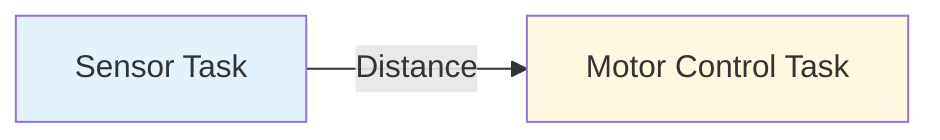
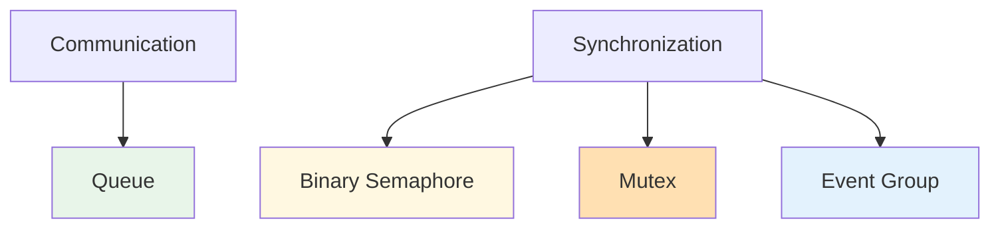

# Chapter 2
# How Do Tasks Cooperate in a Multicore System?

---

## Learning Objectives

After completing this chapter, you should be able to:

- Explain why concurrent tasks need communication mechanisms.
- Differentiate between communication and synchronization.
- Describe the purpose of the main FreeRTOS synchronization mechanisms.
- Select an appropriate synchronization mechanism for a given problem.
- Prepare to implement inter-task communication in Laboratory 2.

---

# 1. Why Do Tasks Need to Cooperate?

A multicore system rarely consists of completely independent tasks.

Instead, tasks often need to exchange information or coordinate their execution.

Consider a mobile robot.

One task continuously measures the distance using an ultrasonic sensor, while another task controls the motors.

For the robot to react correctly, the motor controller must receive the measured distance.

This simple example illustrates that tasks must cooperate to accomplish a common objective.

**Figure 2.1.** One task produces information that another task consumes.

---

# 2. Communication vs. Synchronization

Although these concepts are closely related, they solve different problems.

**Communication** is used when one task needs to transfer information to another task.

**Synchronization** is used when tasks need to coordinate their execution without necessarily exchanging data.

For example:

- Sending a sensor measurement requires communication.
- Waiting until a button is pressed requires synchronization.

Understanding this distinction is essential when selecting the appropriate FreeRTOS mechanism.

> [!NOTE]
>
> Communication transfers data.
>
> Synchronization coordinates execution.

---

# 3. Common FreeRTOS Mechanisms

FreeRTOS provides several mechanisms that support communication and synchronization between tasks.

| Mechanism | Primary Purpose |
|------------|-----------------|
| Queue | Transfer data between tasks |
| Binary Semaphore | Signal that an event has occurred |
| Mutex | Protect shared resources |
| Event Group | Synchronize multiple tasks using events |

Each mechanism solves a different engineering problem.

Selecting the appropriate mechanism simplifies application design and improves reliability.

**Figure 2.2.** Communication and synchronization mechanisms.

---

# 4. Choosing the Right Mechanism

The following table summarizes the most common situations encountered in embedded systems.

| Situation | Recommended Mechanism |
|-----------|-----------------------|
| Send sensor measurements | Queue |
| Notify that a button was pressed | Binary Semaphore |
| Protect a UART peripheral | Mutex |
| Wait until several events occur | Event Group |

There is no universal synchronization mechanism.

The appropriate choice depends on the engineering problem being solved.

---

# 5. What Will You Observe in Laboratory 2?

The concepts introduced in this chapter will be explored through a sequence of guided experiments.

Instead of learning each FreeRTOS mechanism independently, you will progressively build multicore applications that require tasks to communicate and synchronize.

During Laboratory 2 you will investigate questions such as:

- How can one task send information to another?
- What happens when multiple tasks produce data simultaneously?
- How can one task wake another?
- How can multiple tasks safely share the same resource?
- How can several tasks synchronize before continuing execution?

By the end of the laboratory, you will understand not only how these mechanisms work, but also when each one should be used.

---

# Key Takeaways

After completing this chapter, you should remember the following ideas.

- Tasks rarely execute in complete isolation.
- Communication and synchronization solve different problems.
- Queues transfer information between tasks.
- Semaphores, mutexes, and event groups coordinate task execution.
- Selecting the appropriate mechanism simplifies multicore application design.

---

# Preparing for Laboratory 2

In **Laboratory 2**, you will progressively implement multicore applications that require communication and synchronization between tasks executing on different processor cores.

Each laboratory activity introduces one new mechanism while building upon the concepts developed in the previous activities.

By the end of the laboratory, you will be able to design FreeRTOS applications in which multiple tasks cooperate safely and efficiently across both RP2040 processor cores.
